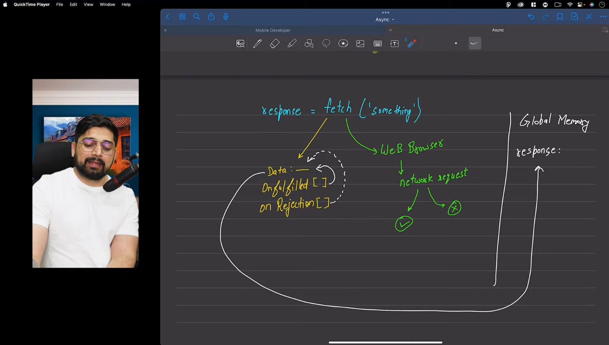

# Fetch
 
 * fetch is an exciting feature of nodejs
 * earlier it was already there in web browser
 * fetch se pahele requests chalti thi uske pahele xhr request chalti thi..
 
 => MDN
 The global fetch() method starts the process of fetching a resource from the network, returning a promise that is fulfilled once the response is available.

 The promise resolves to the Response object representing the response to your request.

 [IMP PARAGRAPH]
* A fetch() promise only rejects when the request fails, for example, because of a badly-formed request URL or a network error.
 A fetch() promise does not reject if the server responds with HTTP status codes that indicate errors (404, 504, etc.).
 Instead, a then() handler must check the Response.ok and/or Response.status properties.

 => in interviews it may be asked that the above code 404 is returned by resolve or reject
 * the answer is that any error code like 404,504, etc is returned by response that is resolve and not by reject,
 * because network request poch gayi issleya to pata chala ki error mai 404 , 504 aaya hai 
 * agar network request pochi hi nahi hoti to kaise pata chalta ki server pe error hai 
 * jar network req server tak poch hi nahi pati ya fir beech mai hi tut jati hai tab reject aata hai

 [Link For the video](https://www.youtube.com/watch?v=Rive84an6Lc&list=PLu71SKxNbfoBuX3f4EOACle2y-tRC5Q37&index=41&ab_channel=ChaiaurCode)

 

